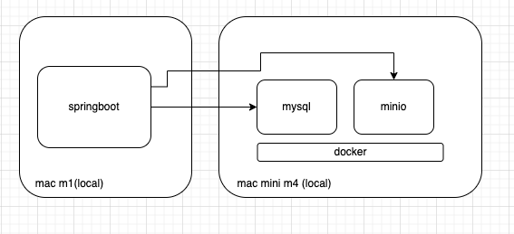
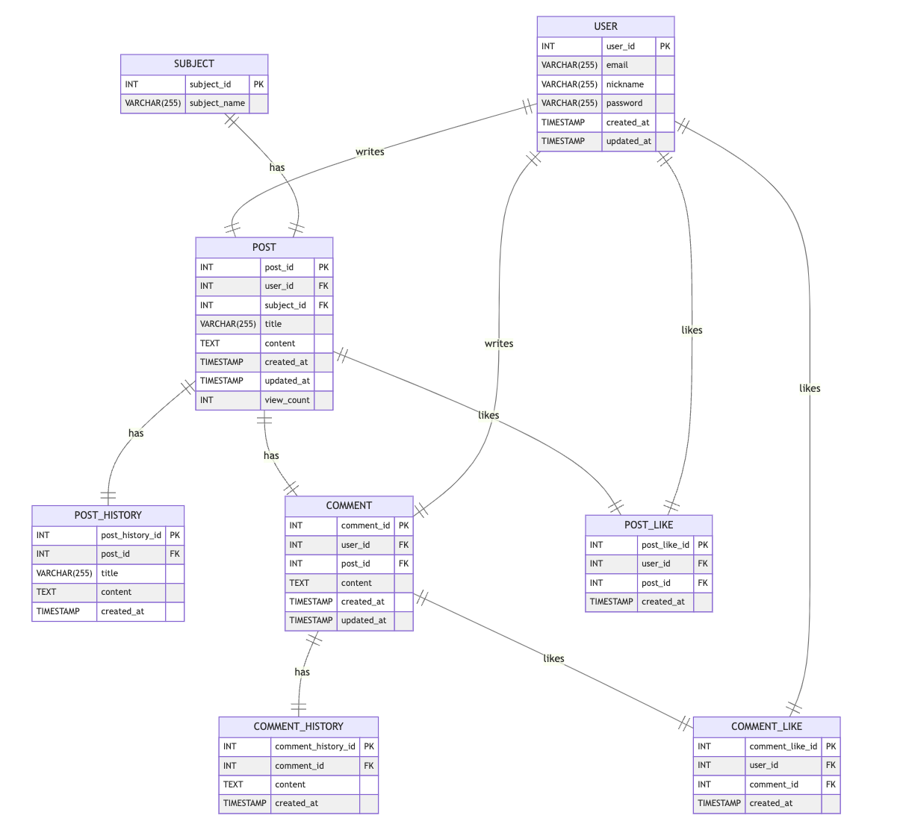

이 프로젝트는 Spring Boot, Java, MyBatis, Thymeleaf, Docker 등을 활용하여 구현한 커뮤니티 게시판입니다. 본 애플리케이션은 사용자 인증, 게시글 및 댓글 관리 기능을 제공하며, 이미지 첨부 및 실시간 조회수 증가와 같은 부가 기능을 포함하고 있습니다.

## 기술 스택

- **Backend Framework:** Spring Boot 2.7.5
- **Language:** Java 8
- **ORM:** MyBatis
- **Template Engine:** Thymeleaf
- **Authentication:** JWT (JSON Web Token)
- **Session Management:** Spring Session (JDBC backed)
- **Containerization:** Docker
    - **DB:** MySQL 8
    - **Image Storage:** Minio
    - **Search Engine (Primary):** Meilisearch
    - **Search Engine (Secondary/Optional):** Elasticsearch



## 주요 기능

### 유저

- **로그인 / 로그아웃:** 사용자 인증 기능 제공
- **회원가입:** 신규 사용자 등록

### 게시글

- **게시글 조회:** 게시글 조회 시 자동으로 view count 증가
- **게시글 좋아요/싫어요:** 로그인된 회원은 게시글에 좋아요 또는 싫어요를 누를 수 있음
- **게시글 작성:** 로그인된 회원은 새 게시글을 작성할 수 있음
- **이미지 첨부:** 게시글 작성 시 이미지 파일 첨부 가능 (Minio를 이용한 이미지 저장)
- **게시글 관리:** 작성자 본인에 한해 게시글 조회, 수정, 삭제 가능
- **변경 이력 추적:** 게시글 수정 내역을 기록하고 조회할 수 있습니다.

### 댓글

- **댓글 작성:** 로그인된 회원은 게시글에 댓글 작성 가능
- **댓글 좋아요/싫어요:** 로그인된 회원은 댓글에 좋아요 또는 싫어요를 누를 수 있음
- **댓글 관리:** 작성자 본인에 한해 댓글 조회, 수정, 삭제 가능
- **변경 이력 추적:** 댓글 수정 내역을 기록하고 조회할 수 있습니다.

### 주제/카테고리

- 게시글을 주제별로 분류하여 관리할 수 있습니다.

### 검색

- 게시글 및 댓글 내용 검색 기능을 제공합니다.
- Meilisearch 및 Elasticsearch를 활용한 검색 최적화.

### 관리자 기능

- **사용자 관리:** 관리자 페이지에서 사용자 정보 조회 및 수정.
- **콘텐츠 관리:** 게시글 및 댓글 관리 기능.

### Bot API

- 자동화된 콘텐츠 생성 및 상호작용을 위한 API를 제공합니다.

테이블의 연관관계는 아래와 같습니다.



## 설치 및 실행

### 전제 조건

- JDK 1.8 이상
- Gradle
- Docker 설치 (MySQL 8, Minio, Meilisearch, Elasticsearch 컨테이너 실행)

### 1. 소스 코드 클론

```bash
git clone https://github.com/hoonzinope/community.git
cd community

```

### 2. Docker 컨테이너 실행

Docker Compose 대신 각 컨테이너를 직접 실행합니다.

**MySQL 8 실행**

```bash
docker run --name mysql8 -e MYSQL_ROOT_PASSWORD=your_password -e MYSQL_DATABASE=your_database -p 3306:3306 -d mysql:8

```

**Minio 실행**

```bash
docker run --name minio -p 9000:9000 -p 9001:9001 -e "MINIO_ROOT_USER=your_access_key" -e "MINIO_ROOT_PASSWORD=your_secret_key" minio/minio server /data --console-address ":9001"

```

**Meilisearch 실행**

```bash
# Meilisearch는 마스터 키 없이 실행하면 자동으로 생성하며, 프로덕션 환경에서는 보안을 위해 마스터 키를 설정하는 것이 좋습니다.
# 예시 (마스터 키 없이 실행): docker run -p 7700:7700 -v $(pwd)/meili_data:/meili_data getmeili/meilisearch:latest
# 또는 마스터키 설정시 (your_master_key 를 실제 키로 변경):
docker run --name meilisearch -p 7700:7700 -e MEILI_MASTER_KEY='your_master_key' -v $(pwd)/meili_data:/meili_data getmeili/meilisearch:latest
```

**Elasticsearch 실행**

```bash
# 단일 노드 개발 모드로 실행합니다.
docker run --name elasticsearch -p 9200:9200 -p 9300:9300 -e "discovery.type=single-node" elasticsearch:7.17.9
```

### 3. 애플리케이션 설정

`src/main/resources/application.properties` 또는 `application.yml` 파일에서 데이터베이스 및 Minio 관련 설정을 본인의 환경에 맞게 수정합니다.

예시:

```
spring.datasource.url=jdbc:mysql://localhost:3306/your_database?useSSL=false&serverTimezone=UTC
spring.datasource.username=root
spring.datasource.password=your_password

minio.endpoint=http://localhost:9000
minio.access-key=your_access_key
minio.secret-key=your_secret_key

# Search engine config
spring.meilisearch.url=http://localhost:7700
spring.meilisearch.api-key=your_master_key # Meilisearch 실행 시 설정한 마스터 키와 동일하게 입력

spring.elasticsearch.uris=http://localhost:9200
```

### 4. 프로젝트 빌드 및 실행

Gradle을 사용하여 애플리케이션을 빌드하고 실행합니다.

```bash
./gradlew clean build
java -jar build/libs/community-board.jar

```

## 프로젝트 구조

```
community-board/
├── src/
│   ├── main/
│   │   ├── java/           # Java 소스 코드
│   │   ├── resources/      # 설정 파일 및 Thymeleaf 템플릿
│   └── test/               # 테스트 코드
├── build.gradle            # Gradle 빌드 파일
└── README.md               # 이 파일

```

---

이 README 파일은 데모 프로젝트의 실행 방법과 주요 기능을 설명하기 위한 목적으로 작성되었습니다. 필요에 따라 내용을 추가하거나 수정하여 사용하시기 바랍니다.